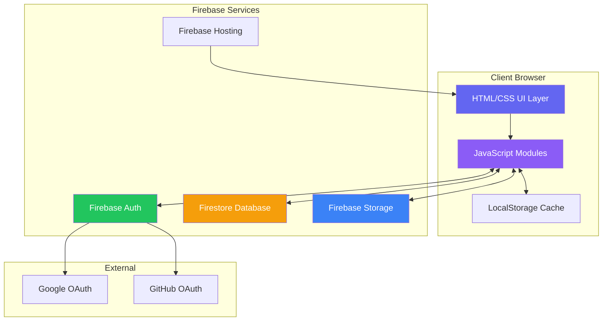
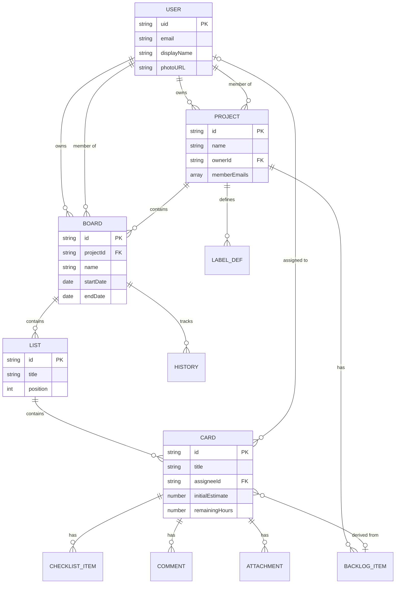
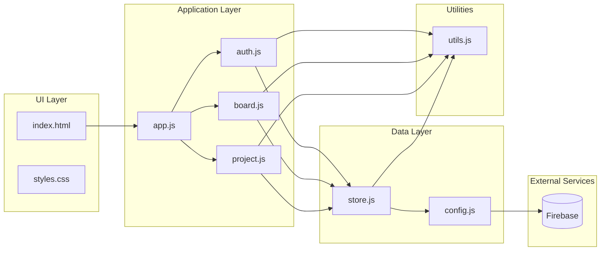
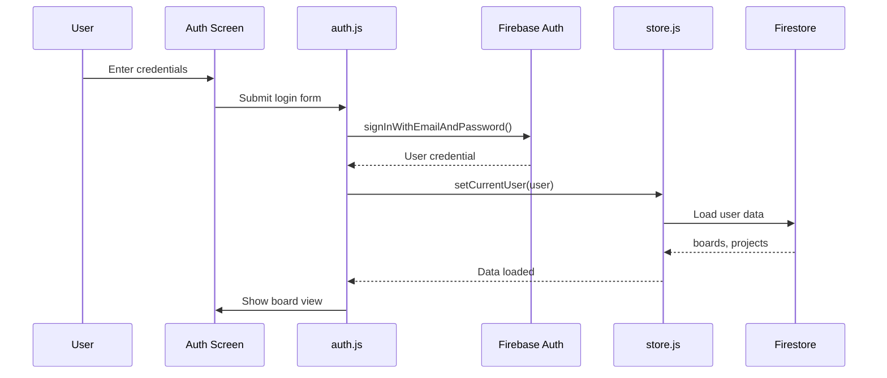
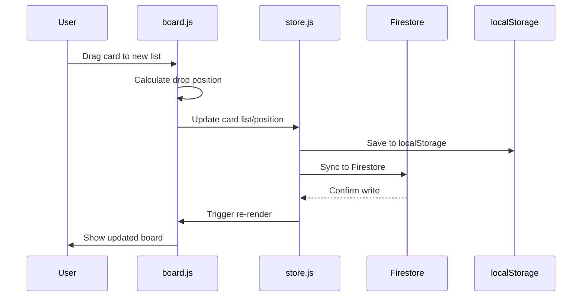
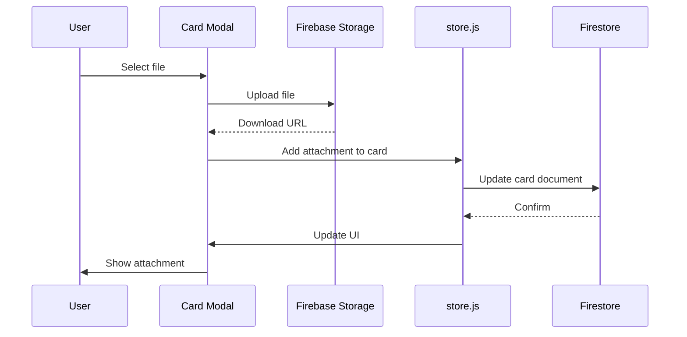

# Scrum71 Architecture Document

## Introduction

This document outlines the overall project architecture for Scrum71, a Scrum/Kanban project management platform. Its primary goal is to serve as the guiding architectural blueprint for development, ensuring consistency and adherence to chosen patterns and technologies.

**Relationship to Frontend Architecture:**
Scrum71 is a client-side single-page application (SPA) with Firebase as the backend. The frontend architecture is integral to this document as there is no separate backend service layer—the browser-based application connects directly to Firebase services.

### Starter Template or Existing Project

**Status:** Existing brownfield project

The architecture is based on an existing vanilla JavaScript application with:
- ES6 modules without build tooling
- Firebase SDK loaded via CDN
- Single HTML entry point with modular JS files
- CSS with custom properties for theming

No starter template is used. The architecture preserves this lightweight approach while extending functionality.

### Change Log

| Date | Version | Description | Author |
|------|---------|-------------|--------|
| 2026-01-09 | 1.0.0 | Initial architecture document | Architecture Team |

---

## High Level Architecture

### Technical Summary

Scrum71 follows a **serverless client-side architecture** where a vanilla JavaScript SPA communicates directly with Firebase services (Firestore for data, Auth for authentication, Storage for files). The application uses ES6 modules for code organization without requiring a build step, enabling rapid development and simple deployment. This architecture supports the PRD goals of simplicity, real-time collaboration, and offline capability through Firebase's built-in features and localStorage fallback.

### High Level Overview

1. **Architectural Style:** Serverless SPA with direct-to-Firebase access
2. **Repository Structure:** Monorepo (single repository containing all frontend code)
3. **Service Architecture:** 
   - Frontend: Vanilla JavaScript ES6 modules
   - Backend: Firebase (managed services)
   - No custom server/API layer
4. **Primary User Flow:**
   - User authenticates via Firebase Auth
   - Browser loads SPA and fetches data from Firestore
   - Real-time listeners sync changes across devices
   - File uploads go directly to Firebase Storage
5. **Key Architectural Decisions:**
   - No build step for simplicity and fast iteration
   - Direct Firestore access (no API layer) for real-time sync
   - Modular JS files for maintainability
   - LocalStorage fallback for offline support

### High Level Project Diagram



### Architectural and Design Patterns

- **Serverless Architecture:** Using Firebase managed services for all backend functionality
  - _Rationale:_ Eliminates server management, provides automatic scaling, aligns with PRD requirement for Firebase free tier usage

- **Module Pattern:** ES6 modules for code organization (`store.js`, `board.js`, `auth.js`, etc.)
  - _Rationale:_ Clean separation of concerns, native browser support, no build tooling required

- **Observer Pattern:** Firebase real-time listeners for live data sync
  - _Rationale:_ Enables multi-device collaboration, automatic UI updates on data changes

- **State Management Pattern:** Centralized state object with getter/setter functions
  - _Rationale:_ Predictable data flow, easy debugging, single source of truth for UI

- **Repository Pattern (Implicit):** Firestore collections as data repositories
  - _Rationale:_ Clear data access layer, consistent CRUD operations, easy to add security rules

- **Optimistic UI Pattern:** LocalStorage cache for offline support
  - _Rationale:_ Better UX during network issues, meets NFR3 offline requirement

---

## Tech Stack

### Cloud Infrastructure

- **Provider:** Firebase (Google Cloud Platform)
- **Key Services:** Authentication, Firestore, Storage, Hosting
- **Deployment Regions:** Auto-managed by Firebase (us-central1 default)

### Technology Stack Table

| Category | Technology | Version | Purpose | Rationale |
|----------|------------|---------|---------|-----------|
| **Language** | JavaScript (ES6+) | ES2020 | Primary development language | Native browser support, no transpilation needed |
| **Runtime** | Browser | Modern (Chrome, Firefox, Safari, Edge) | JavaScript execution | Direct user access, no server runtime needed |
| **UI Framework** | Vanilla JS + DOM API | Native | UI rendering and interaction | Minimal footprint, full control, no framework lock-in |
| **CSS** | CSS3 + Custom Properties | Native | Styling and theming | Native variables for theme switching, no preprocessor needed |
| **Database** | Firestore | v10.7.0 | Real-time document database | Real-time sync, offline support, Firebase integration |
| **Authentication** | Firebase Auth | v10.7.0 | User authentication | OAuth providers, email/password, session management |
| **File Storage** | Firebase Storage | v10.7.0 | File attachments | Direct browser uploads, CDN delivery, Firebase integration |
| **Hosting** | Firebase Hosting | Latest | Static site hosting | Fast CDN, automatic SSL, easy deployment |
| **Charts** | Chart.js | v4.x (CDN) | Burndown visualization | Lightweight, responsive, easy to configure |
| **Fonts** | Google Fonts (Inter) | Latest | Typography | Modern, readable, variable font support |

---

## Data Models

### User

**Purpose:** Represents an authenticated user of the system

**Key Attributes:**
- `uid`: string - Firebase Auth unique identifier
- `email`: string - User's email address
- `displayName`: string - User's display name
- `photoURL`: string (optional) - Profile picture URL
- `mobile`: string (optional) - Phone number
- `bio`: string (optional) - User biography/details
- `currentBoardId`: string (optional) - Last accessed board
- `currentProjectId`: string (optional) - Last accessed project
- `createdAt`: timestamp - Account creation date
- `updatedAt`: timestamp - Last profile update

**Relationships:**
- One user can own multiple Projects
- One user can be a member of multiple Projects/Boards

---

### Project

**Purpose:** Top-level container for organizing related sprints/boards and team

**Key Attributes:**
- `id`: string - Unique identifier
- `name`: string - Project name
- `description`: string - Project description
- `ownerId`: string - Owner's user ID
- `owner`: object - Owner details (name, email, photoURL)
- `memberEmails`: array<string> - List of member emails for querying
- `members`: array<Member> - Full member details
- `backlog`: array<BacklogItem> - Product backlog items
- `sprintIds`: array<string> - References to board/sprint IDs
- `labels`: array<LabelDefinition> - Custom label configurations
- `inviteToken`: string - Shareable invite token
- `createdAt`: timestamp
- `updatedAt`: timestamp

**Relationships:**
- One Project has many Boards (sprints)
- One Project has many Members
- One Project has many BacklogItems

---

### Board (Sprint)

**Purpose:** Represents a sprint as a Kanban board with lists and cards

**Key Attributes:**
- `id`: string - Unique identifier
- `name`: string - Sprint/board name
- `projectId`: string - Parent project reference
- `background`: string - CSS gradient or color
- `goal`: string - Sprint goal description
- `startDate`: string (ISO date) - Sprint start
- `endDate`: string (ISO date) - Sprint end
- `ownerId`: string - Board owner's user ID
- `owner`: object - Owner details
- `memberEmails`: array<string> - Member emails for access control
- `members`: array<Member> - Full member details
- `lists`: array<List> - Board columns
- `history`: array<HistoryEntry> - Burndown data points
- `inviteToken`: string - Shareable invite token
- `createdAt`: timestamp
- `updatedAt`: timestamp

**Relationships:**
- One Board belongs to one Project
- One Board has many Lists
- One Board has many History entries

---

### List

**Purpose:** A column on the board representing a workflow stage

**Key Attributes:**
- `id`: string - Unique identifier
- `title`: string - Column name (e.g., "To Do", "In Progress", "Done")
- `position`: number - Order in board (implicit from array index)
- `cards`: array<Card> - Cards in this list

**Relationships:**
- One List belongs to one Board
- One List has many Cards

---

### Card

**Purpose:** A work item or task with details and tracking

**Key Attributes:**
- `id`: string - Unique identifier
- `title`: string - Card title
- `description`: string - Detailed description (markdown supported)
- `labels`: array<string> - Label identifiers
- `dueDate`: string (ISO date) - Due date
- `assigneeId`: string (optional) - Assigned team member ID
- `assignee`: object (optional) - Assignee details
- `checklist`: array<ChecklistItem> - Subtasks
- `initialEstimate`: number - Initial hours estimate
- `remainingHours`: number - Current remaining hours
- `comments`: array<Comment> - Discussion thread
- `attachments`: array<Attachment> - File attachments
- `createdAt`: timestamp
- `updatedAt`: timestamp

**Relationships:**
- One Card belongs to one List
- One Card may reference one BacklogItem
- One Card has many ChecklistItems, Comments, Attachments

---

### Supporting Types

```javascript
// Member
{
  id: string,
  email: string,
  name: string,
  photoURL: string | null,
  role: 'owner' | 'admin' | 'member',
  addedAt: timestamp
}

// BacklogItem
{
  id: string,
  title: string,
  description: string,
  addedAt: timestamp,
  sprintIds: string[]  // Which sprints include this item
}

// LabelDefinition
{
  id: string,
  color: string,      // CSS color value
  name: string,       // Label meaning (e.g., "Bug", "Feature")
  description: string
}

// ChecklistItem
{
  id: string,
  text: string,
  completed: boolean
}

// Comment
{
  id: string,
  authorId: string,
  author: { name, email, photoURL },
  content: string,
  createdAt: timestamp
}

// Attachment
{
  id: string,
  filename: string,
  url: string,          // Firebase Storage URL
  type: string,         // MIME type
  size: number,         // Bytes
  uploadedBy: string,   // User ID
  uploadedAt: timestamp
}

// HistoryEntry (for burndown)
{
  date: string,         // ISO date
  remaining: number     // Total remaining hours
}
```

---

### Entity Relationship Diagram



---

## Components

### 1. Authentication Module (`auth.js`)

**Responsibility:** Handle all authentication flows and user session management

**Key Interfaces:**
- `initAuth()` - Initialize auth state listener
- `signIn(email, password)` - Email/password login
- `signUp(email, password, name)` - Registration
- `signInWithGoogle()` - OAuth popup flow
- `signInWithGitHub()` - OAuth popup flow
- `signOut()` - Logout user
- `resetPassword(email)` - Password reset email

**Dependencies:** Firebase Auth, Store module

**Technology Stack:** Firebase Auth SDK, DOM events

---

### 2. State Management Module (`store.js`)

**Responsibility:** Centralized data store, Firestore sync, localStorage fallback

**Key Interfaces:**
- `state` - Global state object
- `getCurrentUser() / setCurrentUser(user)` - User state
- `getCurrentBoard()` - Active board getter
- `loadState()` - Load from Firestore/localStorage
- `saveState()` - Persist to Firestore/localStorage
- `initializeSampleData()` - Demo data creation
- `getOrCreateInviteToken()` - Invite link management

**Dependencies:** Firebase Firestore, Utils module

**Technology Stack:** Firestore real-time listeners, localStorage API

---

### 3. Board Rendering Module (`board.js`)

**Responsibility:** Render board UI, handle list/card interactions, drag-and-drop

**Key Interfaces:**
- `renderBoard()` - Full board render
- `createListElement(list)` - List component factory
- `createCardElement(card, list)` - Card component factory
- `initDragAndDrop()` - Drag-drop initialization
- `updateBurndownChart()` - Chart update trigger

**Dependencies:** Store module, Utils module, Chart.js

**Technology Stack:** DOM API, HTML5 Drag-and-Drop, Chart.js

---

### 4. Project Management Module (`project.js`)

**Responsibility:** Project/team management, invite handling, backlog management

**Key Interfaces:**
- `handleInviteLink()` - Process invite URL params
- `openProjectInfoModal()` - Display project details
- `renderProjectManagement()` - PM screen render
- `renderTeamMembers()` - Team list component

**Dependencies:** Store module, Board module, Utils module

**Technology Stack:** DOM API, URL API, Firestore

---

### 5. Application Entry Point (`app.js`)

**Responsibility:** Initialize application, set up event listeners, coordinate modules

**Key Interfaces:**
- `initTheme()` - Theme initialization
- Header selector event handlers
- Modal event handlers
- Global keyboard shortcuts

**Dependencies:** All other modules

**Technology Stack:** ES6 module imports, DOM events

---

### 6. Utilities Module (`utils.js`)

**Responsibility:** Shared helper functions

**Key Interfaces:**
- `generateId()` - UUID generation
- `generateUniqueProjectName()` - Random project names
- `showToast(message, type)` - Notification display
- `getDragAfterElement()` - Drag position calculation

**Dependencies:** None

**Technology Stack:** Pure JavaScript

---

### 7. Configuration Module (`config.js`)

**Responsibility:** Firebase initialization and configuration

**Key Interfaces:**
- `auth` - Firebase Auth instance
- `db` - Firestore instance
- `isFirebaseConfigured` - Configuration status flag

**Dependencies:** Firebase SDK (CDN)

**Technology Stack:** Firebase compat SDK

---

### Component Diagram



---

## External APIs

### Firebase Authentication API

- **Purpose:** User authentication and session management
- **Documentation:** https://firebase.google.com/docs/auth/web/start
- **Base URL(s):** Managed by SDK
- **Authentication:** API Key + OAuth
- **Rate Limits:** 100 accounts/IP/hour (free tier)

**Key Methods Used:**
- `createUserWithEmailAndPassword(email, password)`
- `signInWithEmailAndPassword(email, password)`
- `signInWithPopup(provider)` - Google/GitHub
- `signOut()`
- `sendPasswordResetEmail(email)`
- `onAuthStateChanged(callback)`

---

### Firestore API

- **Purpose:** Real-time document database
- **Documentation:** https://firebase.google.com/docs/firestore
- **Base URL(s):** Managed by SDK
- **Authentication:** Firebase Auth token
- **Rate Limits:** 50K reads/day, 20K writes/day (free tier)

**Key Operations Used:**
- `collection().doc().get()` - Read document
- `collection().doc().set()` - Write document
- `collection().where().get()` - Query documents
- `collection().onSnapshot()` - Real-time listener

**Collections:**
- `users/{uid}` - User profiles
- `projects/{projectId}` - Projects
- `boards/{boardId}` - Boards/Sprints

---

### Firebase Storage API

- **Purpose:** File attachment storage
- **Documentation:** https://firebase.google.com/docs/storage/web/start
- **Base URL(s):** `gs://scrum71.appspot.com`
- **Authentication:** Firebase Auth token
- **Rate Limits:** 1GB storage, 5GB/day downloads (free tier)

**Key Operations Used:**
- `ref().put(file)` - Upload file
- `ref().getDownloadURL()` - Get public URL
- `ref().delete()` - Remove file

**Storage Structure:**
```
/attachments/{boardId}/{cardId}/{filename}
```

---

## Core Workflows

### User Authentication Flow



### Card Movement Flow



### File Attachment Flow



---

## Firestore Security Rules

```javascript
rules_version = '2';
service cloud.firestore {
  match /databases/{database}/documents {
    
    // Helper function to check if user is authenticated
    function isAuthenticated() {
      return request.auth != null;
    }
    
    // Helper to check if user email is in member list
    function isMember(memberEmails) {
      return request.auth.token.email in memberEmails;
    }
    
    // User profiles - users can only read/write their own
    match /users/{userId} {
      allow read, write: if isAuthenticated() && request.auth.uid == userId;
    }
    
    // Projects - members can read, owners can write
    match /projects/{projectId} {
      allow read: if isAuthenticated() && isMember(resource.data.memberEmails);
      allow create: if isAuthenticated();
      allow update, delete: if isAuthenticated() && 
        (resource.data.ownerId == request.auth.uid || 
         isMember(resource.data.memberEmails));
    }
    
    // Boards - members can read/write
    match /boards/{boardId} {
      allow read: if isAuthenticated() && isMember(resource.data.memberEmails);
      allow create: if isAuthenticated();
      allow update, delete: if isAuthenticated() && 
        isMember(resource.data.memberEmails);
    }
  }
}
```

---

## Firebase Storage Rules

```javascript
rules_version = '2';
service firebase.storage {
  match /b/{bucket}/o {
    match /attachments/{boardId}/{cardId}/{fileName} {
      // Allow read if authenticated (simplified - enhance with member check)
      allow read: if request.auth != null;
      
      // Allow write if authenticated and file is under 10MB
      allow write: if request.auth != null 
        && request.resource.size < 10 * 1024 * 1024;
      
      // Allow delete if authenticated
      allow delete: if request.auth != null;
    }
  }
}
```

---

## Project Structure

```
scrum71/
├── docs/
│   ├── prd.md                  # Product Requirements Document
│   └── architecture.md         # This document
├── src/
│   └── js/
│       ├── app.js              # Application entry point
│       ├── auth.js             # Authentication module
│       ├── board.js            # Board rendering & interactions
│       ├── config.js           # Firebase configuration
│       ├── project.js          # Project management
│       ├── store.js            # State management & persistence
│       └── utils.js            # Utility functions
├── index.html                  # Single page app entry
├── styles.css                  # All styles with CSS variables
├── firebase.json               # Firebase hosting config
├── firestore.rules             # Firestore security rules
└── FIREBASE_SETUP.md           # Firebase setup guide
```

---

## Deployment

### Firebase Hosting Deployment

```bash
# Install Firebase CLI
npm install -g firebase-tools

# Login to Firebase
firebase login

# Initialize (already done)
firebase init hosting

# Deploy
firebase deploy --only hosting
```

### GitHub Pages Alternative

The app can also be deployed to GitHub Pages:
1. Push to `main` branch
2. Enable GitHub Pages in repository settings
3. Set source to root directory

---

## Performance Considerations

1. **Lazy Loading:** Consider lazy loading Chart.js only when burndown panel is opened
2. **Firestore Pagination:** For large boards, paginate card queries
3. **Image Optimization:** Compress attachment images before upload
4. **Caching:** Leverage localStorage cache to reduce Firestore reads
5. **Bundle Size:** Monitor CDN dependencies, consider self-hosting critical libraries

---

## Future Enhancements

1. **Service Worker:** Add PWA support for true offline capability
2. **Build Process:** Consider Vite/esbuild if codebase grows significantly
3. **TypeScript:** Migrate to TypeScript for better maintainability
4. **Testing:** Add Vitest for unit tests, Playwright for E2E
5. **Real-time Presence:** Show which team members are viewing the board
