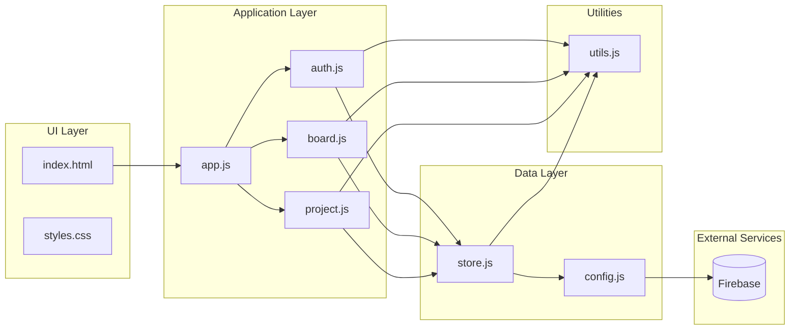

# Components

## 1. Authentication Module (`auth.js`)

**Responsibility:** Handle all authentication flows and user session management

**Key Interfaces:**
- `initAuth()` - Initialize auth state listener
- `signIn(email, password)` - Email/password login
- `signUp(email, password, name)` - Registration
- `signInWithGoogle()` - OAuth popup flow
- `signInWithGitHub()` - OAuth popup flow
- `signOut()` - Logout user
- `resetPassword(email)` - Password reset email

**Dependencies:** Firebase Auth, Store module

**Technology Stack:** Firebase Auth SDK, DOM events

---

## 2. State Management Module (`store.js`)

**Responsibility:** Centralized data store, Firestore sync, localStorage fallback

**Key Interfaces:**
- `state` - Global state object
- `getCurrentUser() / setCurrentUser(user)` - User state
- `getCurrentBoard()` - Active board getter
- `loadState()` - Load from Firestore/localStorage
- `saveState()` - Persist to Firestore/localStorage
- `initializeSampleData()` - Demo data creation
- `getOrCreateInviteToken()` - Invite link management

**Dependencies:** Firebase Firestore, Utils module

**Technology Stack:** Firestore real-time listeners, localStorage API

---

## 3. Board Rendering Module (`board.js`)

**Responsibility:** Render board UI, handle list/card interactions, drag-and-drop

**Key Interfaces:**
- `renderBoard()` - Full board render
- `createListElement(list)` - List component factory
- `createCardElement(card, list)` - Card component factory
- `initDragAndDrop()` - Drag-drop initialization
- `updateBurndownChart()` - Chart update trigger

**Dependencies:** Store module, Utils module, Chart.js

**Technology Stack:** DOM API, HTML5 Drag-and-Drop, Chart.js

---

## 4. Project Management Module (`project.js`)

**Responsibility:** Project/team management, invite handling, backlog management

**Key Interfaces:**
- `handleInviteLink()` - Process invite URL params
- `openProjectInfoModal()` - Display project details
- `renderProjectManagement()` - PM screen render
- `renderTeamMembers()` - Team list component

**Dependencies:** Store module, Board module, Utils module

**Technology Stack:** DOM API, URL API, Firestore

---

## 5. Application Entry Point (`app.js`)

**Responsibility:** Initialize application, set up event listeners, coordinate modules

**Key Interfaces:**
- `initTheme()` - Theme initialization
- Header selector event handlers
- Modal event handlers
- Global keyboard shortcuts

**Dependencies:** All other modules

**Technology Stack:** ES6 module imports, DOM events

---

## 6. Utilities Module (`utils.js`)

**Responsibility:** Shared helper functions

**Key Interfaces:**
- `generateId()` - UUID generation
- `generateUniqueProjectName()` - Random project names
- `showToast(message, type)` - Notification display
- `getDragAfterElement()` - Drag position calculation

**Dependencies:** None

**Technology Stack:** Pure JavaScript

---

## 7. Configuration Module (`config.js`)

**Responsibility:** Firebase initialization and configuration

**Key Interfaces:**
- `auth` - Firebase Auth instance
- `db` - Firestore instance
- `isFirebaseConfigured` - Configuration status flag

**Dependencies:** Firebase SDK (CDN)

**Technology Stack:** Firebase compat SDK

---

## Component Diagram

---
