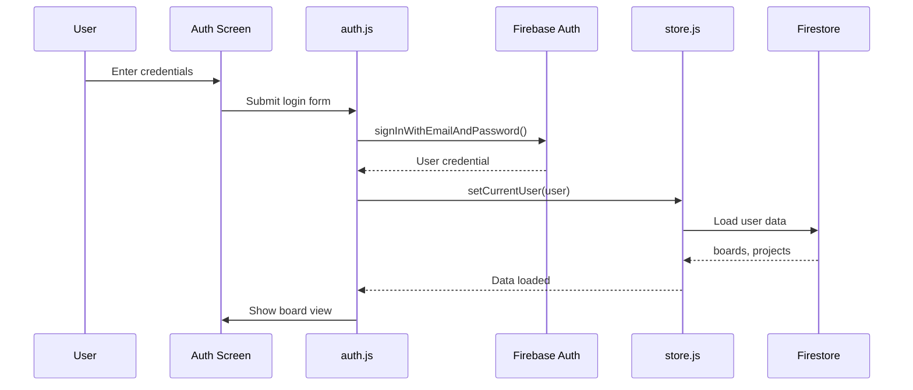
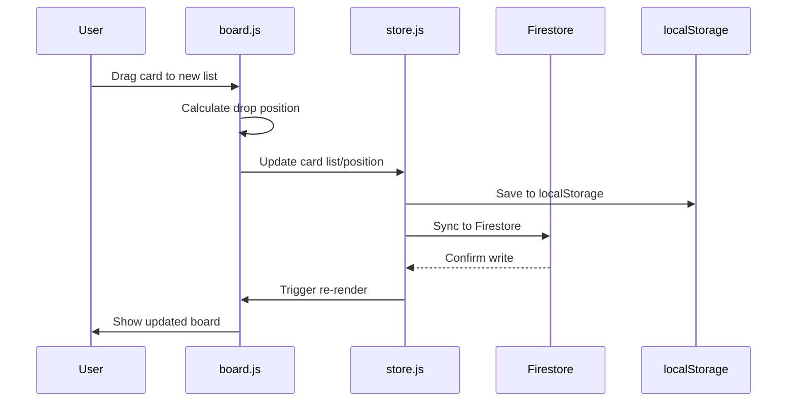
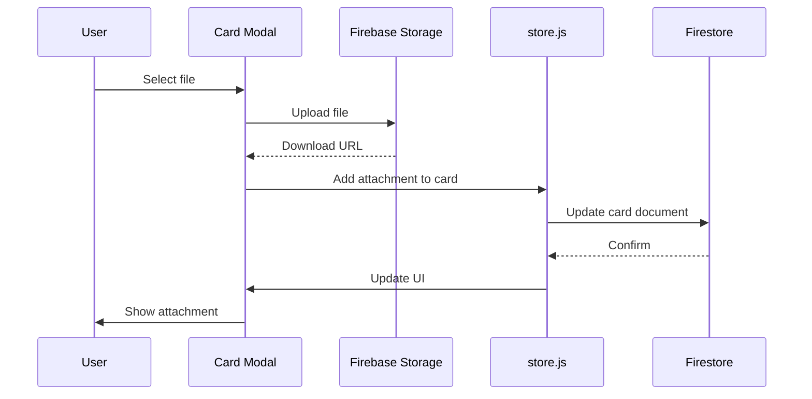

# Core Workflows

## User Authentication Flow

```mermaid
sequenceDiagram
    participant U as User
    participant UI as Auth Screen
    participant AUTH as auth.js
    participant FB as Firebase Auth
    participant STORE as store.js
    participant FS as Firestore
    
    U->>UI: Enter credentials
    UI->>AUTH: Submit login form
    AUTH->>FB: signInWithEmailAndPassword()
    FB-->>AUTH: User credential
    AUTH->>STORE: setCurrentUser(user)
    STORE->>FS: Load user data
    FS-->>STORE: boards, projects
    STORE-->>AUTH: Data loaded
    AUTH->>UI: Show board view
```

## Card Movement Flow

```mermaid
sequenceDiagram
    participant U as User
    participant BOARD as board.js
    participant STORE as store.js
    participant FS as Firestore
    participant LS as localStorage
    
    U->>BOARD: Drag card to new list
    BOARD->>BOARD: Calculate drop position
    BOARD->>STORE: Update card list/position
    STORE->>LS: Save to localStorage
    STORE->>FS: Sync to Firestore
    FS-->>STORE: Confirm write
    STORE->>BOARD: Trigger re-render
    BOARD->>U: Show updated board
```

## File Attachment Flow

```mermaid
sequenceDiagram
    participant U as User
    participant CARD as Card Modal
    participant STORAGE as Firebase Storage
    participant STORE as store.js
    participant FS as Firestore
    
    U->>CARD: Select file
    CARD->>STORAGE: Upload file
    STORAGE-->>CARD: Download URL
    CARD->>STORE: Add attachment to card
    STORE->>FS: Update card document
    FS-->>STORE: Confirm
    STORE->>CARD: Update UI
    CARD->>U: Show attachment
```

---
