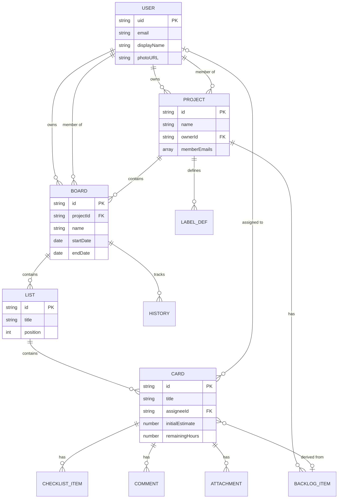

# Data Models

## User

**Purpose:** Represents an authenticated user of the system

**Key Attributes:**
- `uid`: string - Firebase Auth unique identifier
- `email`: string - User's email address
- `displayName`: string - User's display name
- `photoURL`: string (optional) - Profile picture URL
- `mobile`: string (optional) - Phone number
- `bio`: string (optional) - User biography/details
- `currentBoardId`: string (optional) - Last accessed board
- `currentProjectId`: string (optional) - Last accessed project
- `createdAt`: timestamp - Account creation date
- `updatedAt`: timestamp - Last profile update

**Relationships:**
- One user can own multiple Projects
- One user can be a member of multiple Projects/Boards

---

## Project

**Purpose:** Top-level container for organizing related sprints/boards and team

**Key Attributes:**
- `id`: string - Unique identifier
- `name`: string - Project name
- `description`: string - Project description
- `ownerId`: string - Owner's user ID
- `owner`: object - Owner details (name, email, photoURL)
- `memberEmails`: array<string> - List of member emails for querying
- `members`: array<Member> - Full member details
- `backlog`: array<BacklogItem> - Product backlog items
- `sprintIds`: array<string> - References to board/sprint IDs
- `labels`: array<LabelDefinition> - Custom label configurations
- `inviteToken`: string - Shareable invite token
- `createdAt`: timestamp
- `updatedAt`: timestamp

**Relationships:**
- One Project has many Boards (sprints)
- One Project has many Members
- One Project has many BacklogItems

---

## Board (Sprint)

**Purpose:** Represents a sprint as a Kanban board with lists and cards

**Key Attributes:**
- `id`: string - Unique identifier
- `name`: string - Sprint/board name
- `projectId`: string - Parent project reference
- `background`: string - CSS gradient or color
- `goal`: string - Sprint goal description
- `startDate`: string (ISO date) - Sprint start
- `endDate`: string (ISO date) - Sprint end
- `ownerId`: string - Board owner's user ID
- `owner`: object - Owner details
- `memberEmails`: array<string> - Member emails for access control
- `members`: array<Member> - Full member details
- `lists`: array<List> - Board columns
- `history`: array<HistoryEntry> - Burndown data points
- `inviteToken`: string - Shareable invite token
- `createdAt`: timestamp
- `updatedAt`: timestamp

**Relationships:**
- One Board belongs to one Project
- One Board has many Lists
- One Board has many History entries

---

## List

**Purpose:** A column on the board representing a workflow stage

**Key Attributes:**
- `id`: string - Unique identifier
- `title`: string - Column name (e.g., "To Do", "In Progress", "Done")
- `position`: number - Order in board (implicit from array index)
- `cards`: array<Card> - Cards in this list

**Relationships:**
- One List belongs to one Board
- One List has many Cards

---

## Card

**Purpose:** A work item or task with details and tracking

**Key Attributes:**
- `id`: string - Unique identifier
- `title`: string - Card title
- `description`: string - Detailed description (markdown supported)
- `labels`: array<string> - Label identifiers
- `dueDate`: string (ISO date) - Due date
- `assigneeId`: string (optional) - Assigned team member ID
- `assignee`: object (optional) - Assignee details
- `checklist`: array<ChecklistItem> - Subtasks
- `initialEstimate`: number - Initial hours estimate
- `remainingHours`: number - Current remaining hours
- `comments`: array<Comment> - Discussion thread
- `attachments`: array<Attachment> - File attachments
- `createdAt`: timestamp
- `updatedAt`: timestamp

**Relationships:**
- One Card belongs to one List
- One Card may reference one BacklogItem
- One Card has many ChecklistItems, Comments, Attachments

---

## Supporting Types

```javascript
// Member
{
  id: string,
  email: string,
  name: string,
  photoURL: string | null,
  role: 'owner' | 'admin' | 'member',
  addedAt: timestamp
}

// BacklogItem
{
  id: string,
  title: string,
  description: string,
  addedAt: timestamp,
  sprintIds: string[]  // Which sprints include this item
}

// LabelDefinition
{
  id: string,
  color: string,      // CSS color value
  name: string,       // Label meaning (e.g., "Bug", "Feature")
  description: string
}

// ChecklistItem
{
  id: string,
  text: string,
  completed: boolean
}

// Comment
{
  id: string,
  authorId: string,
  author: { name, email, photoURL },
  content: string,
  createdAt: timestamp
}

// Attachment
{
  id: string,
  filename: string,
  url: string,          // Firebase Storage URL
  type: string,         // MIME type
  size: number,         // Bytes
  uploadedBy: string,   // User ID
  uploadedAt: timestamp
}

// HistoryEntry (for burndown)
{
  date: string,         // ISO date
  remaining: number     // Total remaining hours
}
```

---

## Entity Relationship Diagram



---
