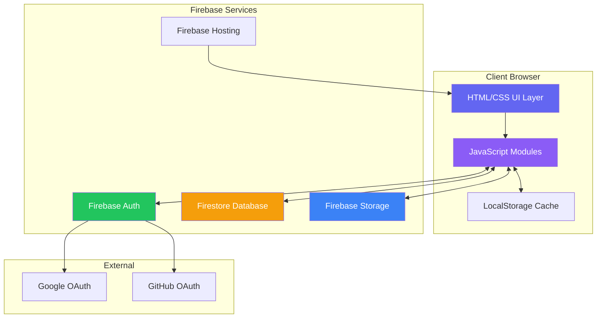

# High Level Architecture

## Technical Summary

Scrum71 follows a **serverless client-side architecture** where a vanilla JavaScript SPA communicates directly with Firebase services (Firestore for data, Auth for authentication, Storage for files). The application uses ES6 modules for code organization without requiring a build step, enabling rapid development and simple deployment. This architecture supports the PRD goals of simplicity, real-time collaboration, and offline capability through Firebase's built-in features and localStorage fallback.

## High Level Overview

1. **Architectural Style:** Serverless SPA with direct-to-Firebase access
2. **Repository Structure:** Monorepo (single repository containing all frontend code)
3. **Service Architecture:** 
   - Frontend: Vanilla JavaScript ES6 modules
   - Backend: Firebase (managed services)
   - No custom server/API layer
4. **Primary User Flow:**
   - User authenticates via Firebase Auth
   - Browser loads SPA and fetches data from Firestore
   - Real-time listeners sync changes across devices
   - File uploads go directly to Firebase Storage
5. **Key Architectural Decisions:**
   - No build step for simplicity and fast iteration
   - Direct Firestore access (no API layer) for real-time sync
   - Modular JS files for maintainability
   - LocalStorage fallback for offline support

## High Level Project Diagram

## Architectural and Design Patterns

- **Serverless Architecture:** Using Firebase managed services for all backend functionality
  - _Rationale:_ Eliminates server management, provides automatic scaling, aligns with PRD requirement for Firebase free tier usage

- **Module Pattern:** ES6 modules for code organization (`store.js`, `board.js`, `auth.js`, etc.)
  - _Rationale:_ Clean separation of concerns, native browser support, no build tooling required

- **Observer Pattern:** Firebase real-time listeners for live data sync
  - _Rationale:_ Enables multi-device collaboration, automatic UI updates on data changes

- **State Management Pattern:** Centralized state object with getter/setter functions
  - _Rationale:_ Predictable data flow, easy debugging, single source of truth for UI

- **Repository Pattern (Implicit):** Firestore collections as data repositories
  - _Rationale:_ Clear data access layer, consistent CRUD operations, easy to add security rules

- **Optimistic UI Pattern:** LocalStorage cache for offline support
  - _Rationale:_ Better UX during network issues, meets NFR3 offline requirement

---
